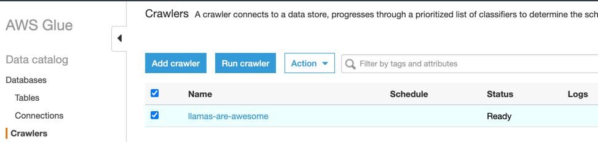

# Trino Example
This is a [WIP] example of a single-node trino instance used for a configuration exercise.

## Prerequisites
* Docker
* docker-compose (version 2.1.1)
  * Fresh install: `brew install docker-compose`
  * Upgrade: `brew upgrade docker-compose`
* An AWS account with [CLI access](https://docs.aws.amazon.com/cli/latest/userguide/getting-started-install.html)

## Quickstart
* Authenticate to AWS and set credentials in your [default profile](https://docs.aws.amazon.com/cli/latest/userguide/cli-configure-files.html)
* To bring up the stack: `BUCKET_NAME=<some-unique-bucket-name> docker-compose up`
* Access the Trino GUI ([http://localhost:8080](http://localhost:8080))
* Run queries against Trino: `docker exec -it trino-cli trino --server trino:8080 --catalog hive-hadoop2 --schema default`

## Components

* trino
  * The Trino docker container (query engine and GUI)
* trino-cli
  * A docker container wrapping the Trino CLI (used to make queries to Trino)
* trino-setup
  * Builds .properties files for Trino.
* data-setup
  * Creates AWS infrastructure (S3 bucket, Glue database/crawler)

## Instructions
### Setup
1. Bring up the Trino stack `BUCKET_NAME=<pick-a-unique-bucket-name> docker-compose up`. Along with Trino itself, it creates some AWS Infrastructure (an AWS S3 bucket with a parquet file, Glue crawler/data)
3. Navigate to the Trino GUI ([http://localhost:8080](http://localhost:8080)) (accepts any username)
4. Start the Trino CLI: `docker exec -it trino-cli trino --server trino:8080 --catalog hive-hadoop2 --schema default`
5. In the Trino CLI prompt, attempt to describe the tables for hive-hadoop2. Does it work?

### Exercises
#### Connect to S3

As part of the `docker-compose up` command that you ran as part of the [Setup](#setup), it created an S3 bucket, some data in the bucket, and some Glue entities including a database and a crawler. This crawler scans your bucket and creates a Hive metadata table for the data in your bucket (you can see the your table in Glue -- it should contain schema data -- once you've manually run the crawler). Your goal is to access that data via the Trino CLI.

* Run the crawler that's pointed at your S3 bucket

* Set up a Hive connector for S3 according to the [documented configuration parameters](https://trino.io/docs/current/connector/hive-s3.html) by adding parameters to [trino-setup/trino-catalog-hive.properties](./trino-setup/trino-catalog-hive.properties)
* **NOTE:** the `hive.metastore.glue.iam-role` property is dynamically set in [trino-setup/trino-build-hive-properties.sh]. You don't need to set this.

Your workflow should look like the following:

1. Add properties to [trino-setup/trino-catalog-hive.properties](./trino-setup/trino-catalog-hive.properties)
2. `docker-compose down` and wait for the stack to be removed
3. `BUCKET_NAME=<your-bucket-name> docker-compose up` and wait for the stack to come up
4. Open Trino ([http://localhost:8080](http://localhost:8080))
5. Open the CLI

```bash
docker exec -it trino-cli trino --server trino:8080 --catalog hive-hadoop2 --schema default
```

6. In the Trino CLI, attempt to query the data in S3.
7. Look at the Trino GUI ([http://localhost:8080](http://localhost:8080)) to see if the query was successful (or why it's failed)
8. If the configuration hasn't worked, `docker-compose down` and start again.

#### Authenticate Users

Once you have set up Trino such that it successfully can access your data in S3, [set up the Trino CLI to authenticate using specific users](https://trino.io/docs/current/installation/cli.html#authentication) that have different permissions at the column level (e.g. certain users can query certain columns).

* Set up [users](https://trino.io/docs/current/security/user-mapping.html) that can authenticate by modifying [trino-setup/trino-config.properties](./trino-setup/trino-config.properties)
* Set up [resource groups](https://trino.io/docs/current/admin/resource-groups.html) such that those users can have permissions to query a subset of the columns by editing [trino-setup/trino-resource-groups.properties](./trino-setup/trino-resource-groups.properties).

Your workflow should look like the following:

1. Add properties to the relevant .properties file
2. `docker-compose down` and wait for the stack to be removed
3. `BUCKET_NAME=<your-bucket-name> docker-compose up` and wait for the stack to come up
4. Open Trino ([http://localhost:8080](http://localhost:8080))
5. Open the CLI

```bash
docker exec -it trino-cli trino --server trino:8080 --catalog hive-hadoop2 --schema default --user <your user>
```

6. In the Trino CLI, attempt to query the data in S3.
7. Look at the Trino GUI ([http://localhost:8080](http://localhost:8080)) to see if the query was successful (or why it's failed)
8. If the configuration hasn't worked, `docker-compose down` and start again.


## References
### Trinio
* https://hub.docker.com/r/trinodb/trino
* https://github.com/trinodb/trino/blob/master/core/docker/README.md
* https://trino.io/docs/current/connector/hive-s3.html


